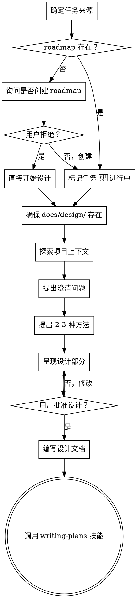

# 将想法头脑风暴为设计

## 概述

通过自然的协作对话帮助将想法转化为完整的设计和规范。

首先了解当前项目上下文，然后逐一提问来完善想法。一旦你理解了要构建什么，呈现设计并获得用户批准。

<HARD-GATE>
在呈现设计并获得用户批准之前，不要调用任何实现技能、编写任何代码、搭建任何项目或采取任何实现行动。这适用于每个项目，无论感知的简单程度如何。
</HARD-GATE>

## 反模式："这太简单了不需要设计"

每个项目都要经过这个过程。待办列表、单函数工具、配置更改——所有这些。"简单"项目是未经审查的假设导致最多浪费工作的地方。设计可以很短（对于真正简单的项目只需几句话），但你必须呈现它并获得批准。

## 快速路径：极简任务

对于以下类型的极简任务，可以跳过完整头脑风暴，直接进入实现：

**可使用快速路径的条件（必须全部满足）：**
- 修改范围 ≤ 1 个文件
- 不涉及新的组件/模块/接口
- 不改变数据流或架构
- 不涉及多人协作或外部依赖

**快速路径适用示例：**
- 修复 typo 或格式问题
- 添加/删除单个配置项
- 重命名变量或函数
- 添加简单的日志或打印语句
- 单文件内的简单重构

**快速路径流程：**
1. 确认任务确实属于快速路径范围
2. 直接询问："这是一个快速路径任务，我可以直接实现。需要我开始吗？"
3. 用户确认后，直接实现
4. 使用 verification-before-completion 验证
5. 完成后调用 finishing-a-development-branch

**必须走完整流程的情况：**
- 添加新功能或组件
- 修改 API 接口
- 涉及数据库 schema 更改
- 多人协作或有外部依赖
- 不确定是否为简单任务时

---

## 检查清单

你必须为以下每个项目创建任务并按顺序完成它们：

1. **确定任务来源并标记状态**
   - 如果用户说"继续开发"、"下一步"或未指定具体功能：
     - 检查 `docs/roadmap/README.md` 是否存在
     - 如果 roadmap 不存在：
       - 询问用户"未找到 roadmap，是否创建新的开发路线图？"
       - 如果用户拒绝：跳过 roadmap 标记，直接开始设计
       - 如果用户确认：创建 roadmap 后标记任务为 🔄 进行中
     - 如果存在：查阅确定当前阶段和下一个未完成任务
     - 向用户确认："下一步是 [任务名]，确定开始吗？"
     - 用户确认后，在 roadmap 中标记任务为 🔄 进行中
   - 如果用户指定了具体功能：直接进入下一步（跳过 roadmap 标记）

2. **确保输出目录存在**
   - 检查 `docs/design/` 目录，不存在则创建
   - 检查 `docs/roadmap/` 目录，不存在则创建
   - 这是设计文档和实现计划的输出位置

3. **探索项目上下文** — 检查文件、文档、最近提交
4. **提出澄清问题** — 一次一个，理解目的/约束/成功标准
5. **提出 2-3 种方法** — 包含权衡和你推荐的建议
6. **呈现设计** — 按其复杂性缩放各部分，每个部分后获得用户批准
7. **编写设计文档** — 保存到 `docs/design/YYYY-MM-DD-<主题>-design.md` 并提交
8. **过渡到实现** — 调用 writing-plans 技能创建实现计划

## 流程图

**最终状态是调用 writing-plans。** 不要调用 frontend-design、mcp-builder 或任何其他实现技能。头脑风暴后你调用的唯一技能是 writing-plans。

## 流程

**理解想法：**
- 首先检查当前项目状态（文件、文档、最近提交）
- 一次问一个问题来完善想法
- 尽可能使用多选题，但开放式也可以
- 每条消息只问一个问题——如果主题需要更多探索，将其分解为多个问题
- 专注于理解：目的、约束、成功标准

**探索方法：**
- 提出 2-3 种不同的方法及其权衡
- 以对话方式呈现选项，包含你的建议和理由
- 首先呈现你推荐的选项并解释原因

**呈现设计：**
- 一旦你认为你理解了要构建什么，呈现设计
- 根据复杂性缩放每个部分：如果直接则几句话，如果复杂则最多 200-300 字
- 每个部分后询问目前是否正确
- 涵盖：架构、组件、数据流、错误处理、测试
- 准备好返回并澄清如果有不明白的地方

## 设计之后

**文档化：**
- 确保输出目录存在：检查并创建 `docs/design/`
- 将验证的设计写入 `docs/design/YYYY-MM-DD-<主题>-design.md`
- 如果可用，使用 elements-of-style:writing-clearly-and-concisely 技能
- 将设计文档提交到 git

**实现：**
- 调用 writing-plans 技能创建详细的实现计划
- 不要调用任何其他技能。writing-plans 是下一步。

## 关键原则

- **一次一个问题** - 不要用多个问题淹没用户
- **首选多选题** - 比开放式更容易回答（当可能时）
- **严格遵循 YAGNI** - 从所有设计中删除不必要的功能
- **探索替代方案** - 在确定之前总是提出 2-3 种方法
- **增量验证** - 呈现设计，在继续之前获得批准
- **保持灵活** - 当不明白时返回并澄清

## 结束声明

完成设计文档编写并提交后，宣布："头脑风暴完成。设计文档已保存到 `docs/design/`。"