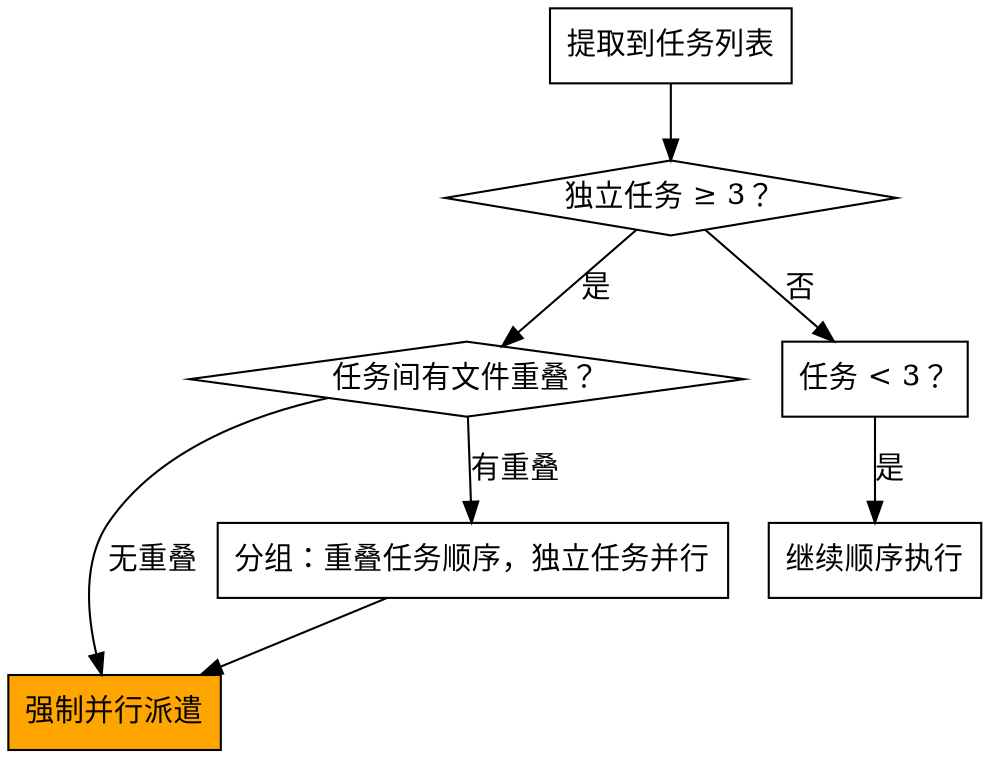

# 派遣并行 Agent

当你有多个独立任务时，顺序执行是浪费。每个独立任务域派遣一个 agent，让它们并发工作。

**核心原则：** 独立任务必须并行。顺序执行独立任务 = 违反工作流。

<HARD-GATE>
当以下条件同时满足时，必须使用并行派遣，不允许顺序执行：

1. 独立任务数量 ≥ 3
2. 任务之间没有输出依赖（任务 A 的结果不是任务 B 的输入）
3. 任务不修改同一个文件

违反此规则 = 人为串行化可并行的工作，直接停止并改为并行派遣。

合理化列表（这些都不是例外）：
- "顺序更容易控制" → 并行派遣，审查整合结果
- "怕冲突" → 检查文件重叠，确认无重叠后并行
- "只有 3 个任务，顺序也快" → 3 个是触发阈值，必须并行
- "先试一个看看" → 这是顺序执行的伪装，不允许
</HARD-GATE>

## 何时触发



**必须并行的场景：**
- 3 个以上测试文件因不同原因失败
- 多个子系统独立损坏
- 计划中 3 个以上互不依赖的实现任务
- 不同模块的独立功能开发

**不使用并行的场景：**
- 任务有明确的输出→输入依赖链
- 任务修改同一个核心文件
- 探索性调试（还不知道哪里坏了）
- 任务总数 < 3

## 流程

### 第一步：独立性评估（必做）

提取任务列表后，为每个任务填写：

```
任务 N：[名称]
  修改文件：[列表]
  依赖任务：[无 / 任务X的输出]
  可并行：[是/否]
```

找出所有"可并行=是"且"无文件重叠"的任务 → 这些必须并行派遣。

### 第二步：创建专注的 Agent 任务

每个并行 agent 必须包含：
- **特定范围：** 一个明确的任务域（一个文件或子系统）
- **完整上下文：** 不让 agent 自己读计划文件，直接提供任务全文
- **明确约束：** 不要修改范围外的代码
- **期望输出格式：** 发现了什么、修改了什么、测试结果

### 第三步：并行派遣

```
Task (subagent_type="implementer"): 任务 A
Task (subagent_type="implementer"): 任务 B  
Task (subagent_type="implementer"): 任务 C
// 三个同时运行
```

### 第四步：整合与验证

所有 agent 返回后：
1. **审查每个报告** - 理解每个 agent 改变了什么
2. **检查冲突** - Agent 是否意外编辑了相同代码？
3. **运行完整测试套件** - 验证所有修复协同工作
4. **派遣 code-reviewer** - 整体质量审查

## Agent 提示结构

好的并行 agent 提示必须包含：

```markdown
你正在独立实现任务 [N]：[名称]

## 任务描述（完整文本）
[直接粘贴任务全文，不要让 agent 读文件]

## 你的工作范围
只修改以下文件：
- [文件 A]
- [文件 B]
不要修改其他任何文件。

## 上下文
[架构背景、相关依赖、注意事项]

## 约束
- 遵循 TDD：先写失败测试
- 提交时使用 feat/fix 前缀
- 完成后报告：修改了什么、测试结果、遇到的问题

## 报告格式
- 实现了什么
- 测试结果（X/X 通过）
- 修改的文件列表
- 任何疑虑或遗留问题
```

## 冲突预防

**派遣前必须确认：**

```
Agent 1 修改文件：[A, B]
Agent 2 修改文件：[C, D]
Agent 3 修改文件：[E, F]

文件重叠？→ 无 ✅ 可以并行
```

如果有文件重叠：
- 将重叠文件的任务合并给同一个 agent
- 或将有依赖关系的任务改为顺序执行

## 常见错误

**❌ 范围太宽：** "修复所有测试" → agent 会迷失
**✅ 具体范围：** "修复 game-state.test.ts 中的 3 个失败"

**❌ 没有提供上下文：** agent 自己去读计划文件
**✅ 直接提供：** 将任务全文粘贴到 prompt 中

**❌ 没有文件约束：** agent 可能重构整个模块
**✅ 明确约束：** "只修改 packages/server/src/sockets/"

**❌ 忽略重叠：** 两个 agent 同时修改同一文件
**✅ 提前检查：** 派遣前确认文件集合无交集

## 整合

**被以下强制调用：**
- **subagent-driven-development** — 提取到 3+ 独立任务时强制触发
- **executing-plans** — 批次中有 3+ 独立任务时强制触发

**配对使用：**
- **using-git-worktrees** — 并行 agent 在同一 worktree 中工作
- **code-reviewer** — 所有 agent 完成后整体审查

## 现实世界影响

来自调试会话（2025-10-03）：
- 3 个文件中有 6 个失败
- 并行派遣 3 个 agent
- 所有调查并发完成
- 所有修复成功整合
- agent 更改之间零冲突
- **节省时间：顺序需要 3x，并行只需 1x**
