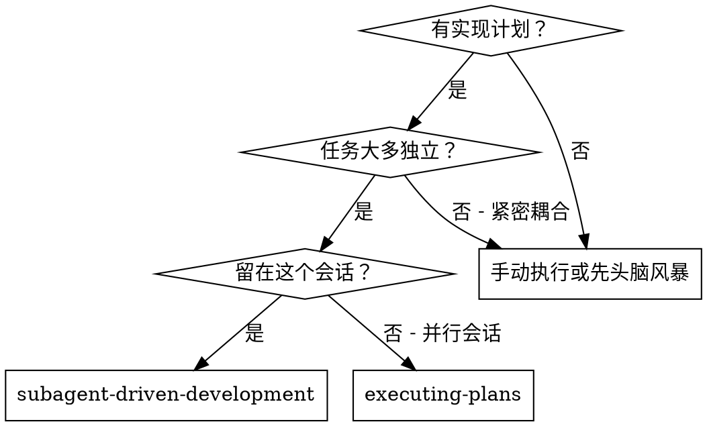
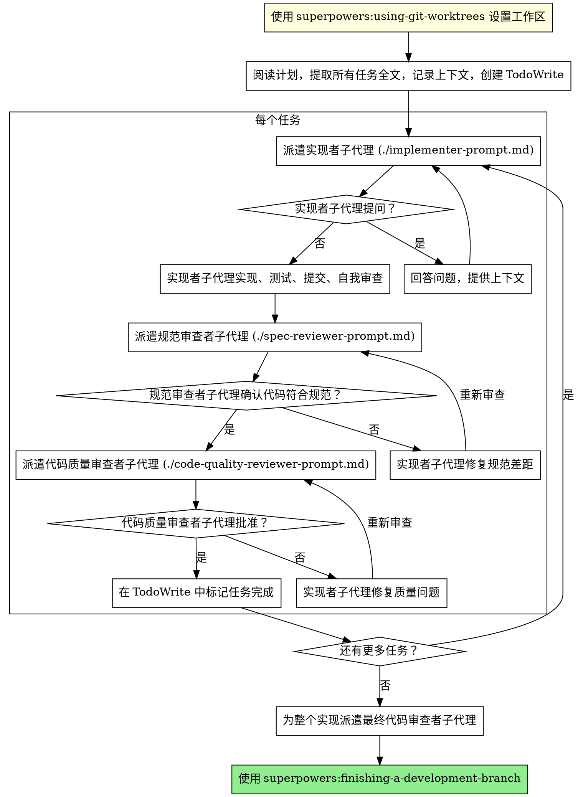

# 子代理驱动开发

通过为每个任务派遣新鲜子代理来执行计划，每个任务后进行两阶段审查：先规范合规性审查，然后代码质量审查。

**核心原则：** 每个任务新鲜子代理 + 两阶段审查（先规范后质量）= 高质量，快速迭代

## 何时使用



**vs. Executing Plans（并行会话）：**
- 同一会话（无上下文切换）
- 每个任务新鲜子代理（无上下文污染）
- 每个任务后两阶段审查：先规范合规性，然后代码质量
- 更快迭代（任务间无人在环）

## 简化模式：小任务

对于小任务，可以使用简化审查流程，减少子代理调用开销。

**简化模式适用条件（满足任一即可）：**
- 修改范围 ≤ 50 行代码
- 不涉及新 API 或接口
- 不改变数据流
- 测试用例 ≤ 3 个

**简化模式 vs 完整模式：**

| 阶段 | 完整模式 | 简化模式 |
|------|---------|---------|
| 实现者 | ✅ | ✅ |
| 规范审查者 | ✅ | ❌ 跳过 |
| 代码质量审查者 | ✅ | ✅ (简化) |
| 最终审查 | ✅ | ✅ |

**简化模式流程：**
1. 派遣实现者子代理
2. 派遣代码质量审查者（简化版本，不检查规范合规性）
3. 标记任务完成
4. 保留最终审查

**如何选择：**
- 大任务（功能、模块、API）→ 完整模式
- 小任务（修复、配置、小重构）→ 简化模式

## 流程



## 提示模板

- `./implementer-prompt.md` - 派遣实现者子代理
- `./spec-reviewer-prompt.md` - 派遣规范合规性审查者子代理
- `./code-quality-reviewer-prompt.md` - 派遣代码质量审查者子代理

## 示例工作流

```
你：我正在使用 Subagent-Driven Development 来执行这个计划。

[一次性阅读计划文件：docs/roadmap/feature-plan.md]
[提取所有 5 个任务及其全文和上下文]
[创建包含所有任务的 TodoWrite]

任务 1：Hook 安装脚本

[获取任务 1 文本和上下文（已提取）]
[派遣实现子代理，提供完整任务文本 + 上下文]

实现者："在开始之前 - hook 应该安装在用户级还是系统级？"

你："用户级（~/.config/superpowers/hooks/）"

实现者："明白了。现在开始实现..."
[稍后] 实现者：
  - 实现了 install-hook 命令
  - 添加了测试，5/5 通过
  - 自我审查：发现漏了 --force 标志，已添加
  - 已提交

[派遣规范合规性审查者]
规范审查者：✅ 规范合规 - 所有需求满足，无多余内容

[获取 git SHA，派遣代码质量审查者]
代码审查者：优点：测试覆盖好，干净。问题：无。已批准。

[标记任务 1 完成]

任务 2：恢复模式

[获取任务 2 文本和上下文（已提取）]
[派遣实现子代理，提供完整任务文本 + 上下文]

实现者：[无问题，继续]
实现者：
  - 添加了 verify/repair 模式
  - 8/8 测试通过
  - 自我审查：都好
  - 已提交

[派遣规范合规性审查者]
规范审查者：❌ 问题：
  - 缺少：进度报告（规范说"每 100 项报告"）
  - 多余：添加了 --json 标志（未请求）

[实现者修复问题]
实现者：删除了 --json 标志，添加了进度报告

[规范审查者再次审查]
规范审查者：✅ 现在规范合规

[派遣代码质量审查者]
代码审查者：优点：扎实。问题（重要）：魔术数字 (100)

[实现者修复]
实现者：提取了 PROGRESS_INTERVAL 常量

[代码审查者再次审查]
代码审查者：✅ 已批准

[标记任务 2 完成]

...

[所有任务后]
[派遣最终代码审查者]
最终审查者：所有需求满足，准备好合并

完成！
```

## 优势

**vs. 手动执行：**
- 子代理自然遵循 TDD
- 每个任务新鲜上下文（无混淆）
- 并行安全（子代理不干扰）
- 子代理可以提问（工作前和工作期间）

**vs. Executing Plans：**
- 同一会话（无交接）
- 持续进展（无等待）
- 自动审查检查点

**效率提升：**
- 无文件读取开销（控制器提供全文）
- 控制器精心策划所需上下文
- 子代理预先获得完整信息
- 问题在工作开始前就浮现（不是之后）

**质量门：**
- 自我审查在交接前捕获问题
- 两阶段审查：规范合规性，然后代码质量
- 审查循环确保修复实际有效
- 规范合规性防止过度/不足构建
- 代码质量确保实现构建良好

**成本：**
- 更多子代理调用（每个任务 1 个实现者 + 2 个审查者）
- 控制器做更多准备工作（预先提取所有任务）
- 审查循环增加迭代
- 但早期捕获问题（比后来调试便宜）

## 危险信号

**永远不要：**
- 在没有明确用户同意的情况下在 main/master 分支上开始实现
- 跳过审查（规范合规性或代码质量）
- 继续处理未修复的问题
- 并行派遣多个实现子代理（冲突）
- 让子代理读取计划文件（改为提供全文）
- 跳过场景设置上下文（子代理需要理解任务在哪里适合）
- 忽略子代理问题（在让它们继续之前回答）
- 对规范合规性接受"足够接近"（规范审查者发现问题 = 未完成）
- 跳过审查循环（审查者发现问题 = 实现者修复 = 再次审查）
- 让实现者自我审查代替实际审查（两者都需要）
- **在规范合规性 ✅ 之前开始代码质量审查**（错误顺序）
- 在任一审查有未解决问题时移至下一个任务
- **未运行测试验证就标记任务完成**

**如果子代理提问：**
- 清晰完整地回答
- 如果需要则提供额外上下文
- 不要催促它们进入实现

**如果审查者发现问题：**
- 实现者（同一子代理）修复它们
- 审查者再次审查
- 重复直到批准
- 不要跳过重新审查

**如果子代理失败任务：**
- 派遣修复子代理，提供具体指令
- 不要尝试手动修复（上下文污染）

## 错误恢复机制

当子代理无法完成任务时：

**1. 诊断问题**
- 子代理报告失败原因
- 确定是否需要外部帮助（依赖缺失、需求不清等）

**2. 呈现恢复选项**

```
任务 [N] 遇到阻碍：[原因]

恢复选项：
1. 继续尝试 - 提供更多信息后让子代理重试
2. 跳过此任务 - 标记为阻塞，继续下一个
3. 回滚更改 - 撤销当前任务的更改，重新开始
4. 停止执行 - 保留进度，等待外部解决

选择哪个选项？
```

**3. 执行恢复**

| 选项 | 操作 | Roadmap 更新 |
|------|------|--------------|
| 继续尝试 | 提供信息后重试当前任务 | 保持 🔄 |
| 跳过任务 | 继续下一任务 | 更新为 ❌ 已阻塞 |
| 回滚更改 | git checkout 撤销更改，重新开始当前任务 | 保持 🔄 |
| 停止执行 | 报告当前状态，等待用户 | 保持 🔄 |

**跳过任务时，需要在 `docs/roadmap/README.md` 中更新任务状态为 ❌：**

```markdown
| 任务名 | ❌ | - | - |
```

## 整合

**必需的工作流技能：**
- **superpowers:using-git-worktrees** - 必需：开始前设置隔离工作区
- **superpowers:writing-plans** - 创建此技能执行的计划
- **superpowers:finishing-a-development-branch** - 所有任务完成后完成开发

**内部审查模板（本技能自带）：**
- `./implementer-prompt.md` - 实现者子代理
- `./spec-reviewer-prompt.md` - 规范合规性审查者
- `./code-quality-reviewer-prompt.md` - 代码质量审查者

**子代理应该使用：**
- **superpowers:test-driven-development** - 子代理为每个任务遵循 TDD

**替代工作流：**
- **superpowers:executing-plans** - 用于并行会话而不是同一会话执行