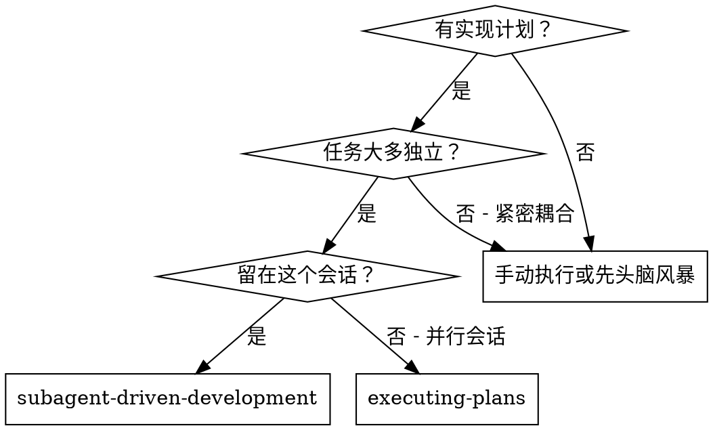
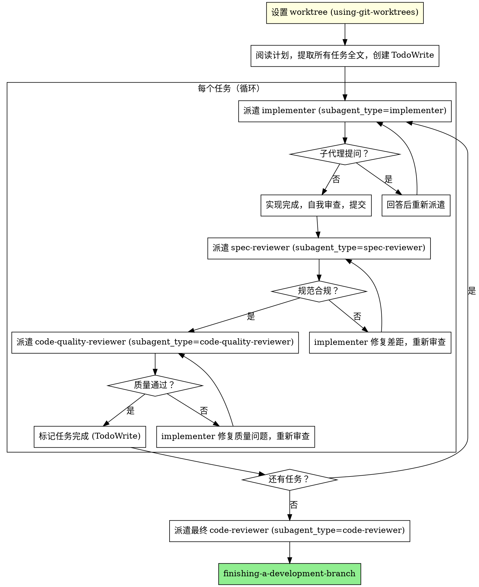

# 子代理驱动开发

通过为每个任务派遣新鲜子代理来执行计划，每个任务后进行两阶段审查：先规范合规性审查，然后代码质量审查。

**核心原则：** 每个任务新鲜子代理 + 两阶段审查（先规范后质量）= 高质量，快速迭代

## 何时使用

<HARD-GATE name="no-direct-coding">
控制器会话禁止直接编写任何实现代码。所有代码实现必须通过 Task 工具派遣 implementer 子代理完成。
违规的常见合理化——全部无效：
- "这个任务太小了" → 小任务用简化模式，但仍然派遣子代理
- "只是改一行" → 仍然派遣子代理
- "子代理太慢了" → 模型切换是必须的，不是可选的
</HARD-GATE>

<HARD-GATE name="worktree-required">
在派遣任何实现子代理之前，必须已通过 superpowers:using-git-worktrees 设置隔离工作区。
未在 worktree 中开始实现 = 违规，无论理由是什么。
</HARD-GATE>

## 简化模式：小任务

**适用条件（满足任一）：** 修改范围 ≤ 50 行 / 不涉及新 API 或接口 / 不改变数据流 / 测试用例 ≤ 3 个

| 阶段           | 完整模式 | 简化模式  |
| -------------- | -------- | --------- |
| 实现者         | ✅       | ✅        |
| 规范审查者     | ✅       | ❌ 跳过   |
| 代码质量审查者 | ✅       | ✅ (简化) |
| 最终审查       | ✅       | ✅        |

大任务（功能、模块、API）→ 完整模式。小任务（修复、配置、小重构）→ 简化模式。

## 流程

## 提示模板

- `./implementer-prompt.md` — 派遣 implementer 子代理
- `./spec-reviewer-prompt.md` — 派遣规范合规性审查者子代理
- `./code-quality-reviewer-prompt.md` — 派遣代码质量审查者子代理

参考示例：[example-workflow.md](./example-workflow.md)
遇到阻碍：[error-recovery.md](./error-recovery.md)

## 危险信号

**永远不要：**

- 在 main/master 分支上开始实现（需明确用户同意）
- 跳过规范审查或质量审查
- 继续处理有未修复问题的任务
- 并行派遣多个 implementer（会产生冲突）
- 让子代理自己读取计划文件（控制器提供全文）
- 忽略子代理提问（先回答再继续）
- 对规范合规接受"足够接近"（规范审查者发现问题 = 任务未完成）
- **在规范合规 ✅ 之前开始代码质量审查**（顺序不能颠倒）
- 未运行测试就标记任务完成

## 整合

**必需技能：**

- **superpowers:using-git-worktrees** — 开始前设置隔离工作区
- **superpowers:finishing-a-development-branch** — 所有任务完成后
