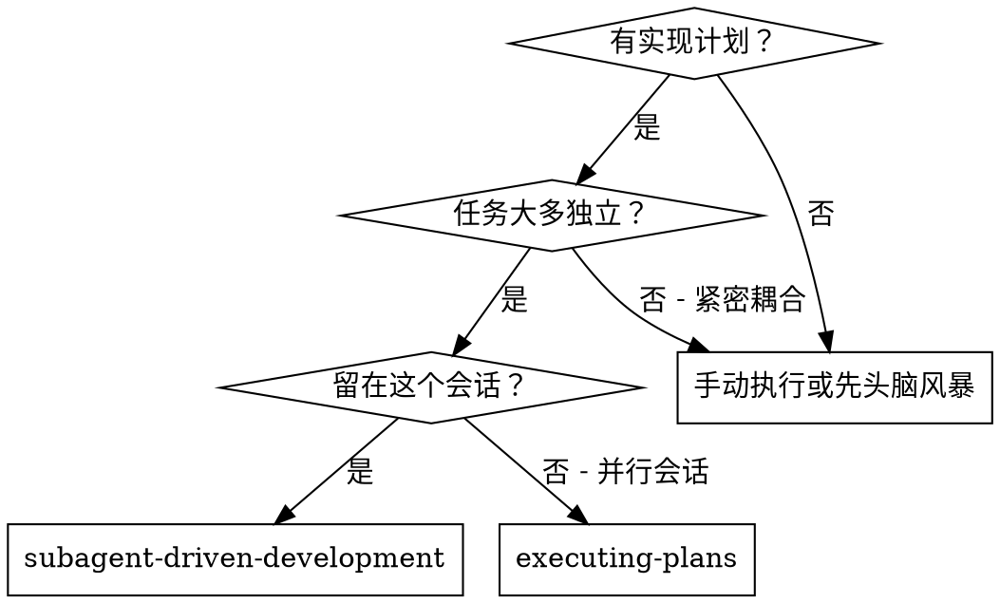
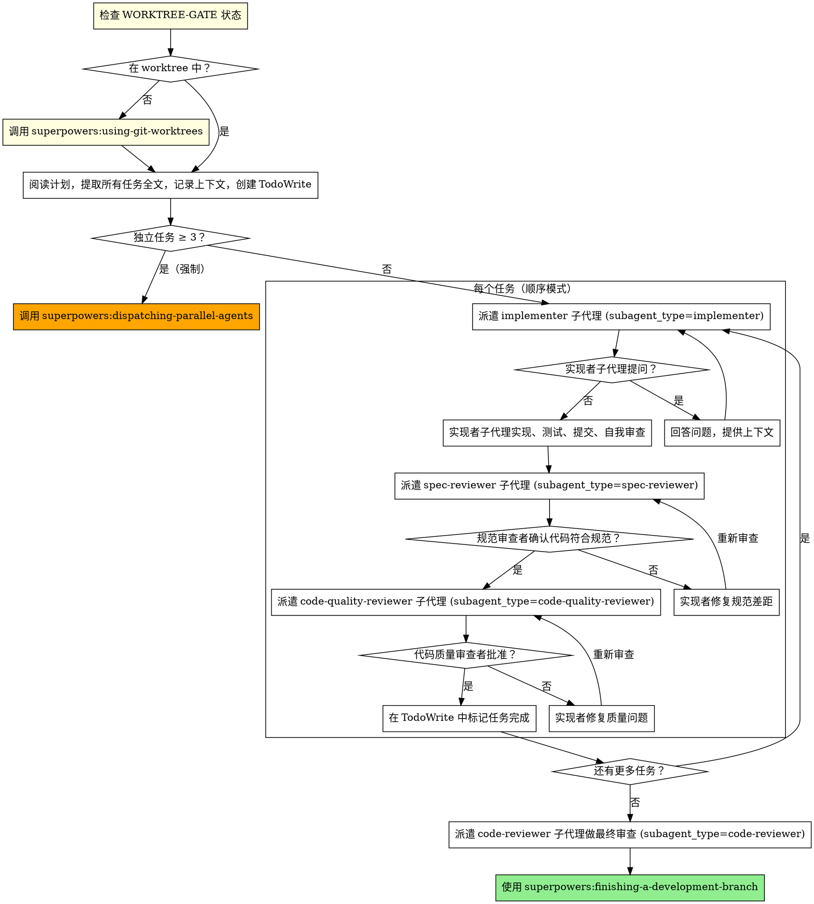

# 子代理驱动开发

通过为每个任务派遣新鲜子代理来执行计划，每个任务后进行两阶段审查：先规范合规性审查，然后代码质量审查。

**核心原则：** 每个任务新鲜子代理 + 两阶段审查（先规范后质量）= 高质量，快速迭代

<HARD-GATE>
永远不要在控制器会话中直接写代码。

所有实现必须通过 Task 工具派遣子代理完成。没有例外。

直接写代码 = 违反工作流。立即停止，改为派遣 implementer 子代理。

合理化列表（这些都不是例外）：
- "这只是一行修改" → 派遣子代理
- "很简单，直接改更快" → 派遣子代理
- "子代理太重了" → 派遣子代理
- "用户让我直接改" → 告知用户必须走子代理流程
</HARD-GATE>

<HARD-GATE>
开始任何任务前必须在 worktree 中。

如果 PreImplementation hook 输出 `[WORKTREE-GATE] ❌`，立即停止，调用
superpowers:using-git-worktrees 创建隔离工作区，然后再继续。

不允许在主分支上实现任何内容。
</HARD-GATE>

## 何时使用



**vs. Executing Plans（并行会话）：**
- 同一会话（无上下文切换）
- 每个任务新鲜子代理（无上下文污染）
- 每个任务后两阶段审查：先规范合规性，然后代码质量
- 更快迭代（任务间无人在环）

## 简化模式：小任务

对于小任务，可以使用简化审查流程，减少子代理调用开销。

**简化模式适用条件（满足任一即可）：**
- 修改范围 ≤ 50 行代码
- 不涉及新 API 或接口
- 不改变数据流
- 测试用例 ≤ 3 个

**简化模式 vs 完整模式：**

| 阶段 | 完整模式 | 简化模式 |
|------|---------|---------|
| 实现者 | ✅ | ✅ |
| 规范审查者 | ✅ | ❌ 跳过 |
| 代码质量审查者 | ✅ | ✅ (简化) |
| 最终审查 | ✅ | ✅ |

**简化模式流程：**
1. 派遣实现者子代理
2. 派遣代码质量审查者（简化版本，不检查规范合规性）
3. 标记任务完成
4. 保留最终审查

**如何选择：**
- 大任务（功能、模块、API）→ 完整模式
- 小任务（修复、配置、小重构）→ 简化模式

## 并行任务检测（强制）

**提取计划所有任务后，立即评估：**

```
独立任务数 ≥ 3 个？
  → 必须调用 superpowers:dispatching-parallel-agents
  → 不允许顺序派遣独立任务

独立任务数 < 3 个？
  → 继续顺序派遣
```

**独立任务的判断标准：**
- 任务 A 不需要任务 B 的输出才能开始
- 两个任务不修改同一个文件
- 两个任务不共享可变状态

**这不是可选的。** 3 个以上独立任务顺序执行 = 浪费时间，违反工作流。

## 流程



## 提示模板

- `./implementer-prompt.md` — 派遣 implementer 子代理
- `./spec-reviewer-prompt.md` — 派遣 spec-reviewer 子代理
- `./code-quality-reviewer-prompt.md` — 派遣 code-quality-reviewer 子代理

## 危险信号

**永远不要：**
- 在没有明确用户同意的情况下在 main/master 分支上开始实现
- 跳过审查（规范合规性或代码质量）
- 继续处理未修复的问题
- 并行派遣多个实现子代理（冲突）
- 让子代理读取计划文件（改为提供全文）
- **在控制器会话中直接写任何代码**（最重要）
- **worktree 未就绪时开始实现**
- **3 个以上独立任务时仍顺序执行**

## 错误恢复机制

当子代理无法完成任务时：

**1. 诊断问题**
- 子代理报告失败原因
- 确定是否需要外部帮助（依赖缺失、需求不清等）

**2. 呈现恢复选项**

```
任务 [N] 遇到阻碍：[原因]

恢复选项：
1. 继续尝试 - 提供更多信息后让子代理重试
2. 跳过此任务 - 标记为阻塞，继续下一个
3. 回滚更改 - 撤销当前任务的更改，重新开始
4. 停止执行 - 保留进度，等待外部解决

选择哪个选项？
```

**3. 执行恢复**

| 选项 | 操作 | Roadmap 更新 |
|------|------|--------------|
| 继续尝试 | 提供信息后重试当前任务 | 保持 🔄 |
| 跳过任务 | 继续下一任务 | 更新为 ❌ 已阻塞 |
| 回滚更改 | git checkout 撤销更改，重新开始当前任务 | 保持 🔄 |
| 停止执行 | 报告当前状态，等待用户 | 保持 🔄 |

## 整合

**必需的工作流技能：**
- **superpowers:using-git-worktrees** - 必需：开始前设置隔离工作区
- **superpowers:writing-plans** - 创建此技能执行的计划
- **superpowers:finishing-a-development-branch** - 所有任务完成后完成开发
- **superpowers:dispatching-parallel-agents** - 必需：3 个以上独立任务时强制使用
