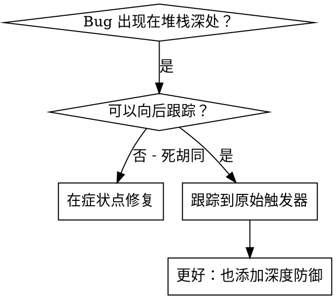
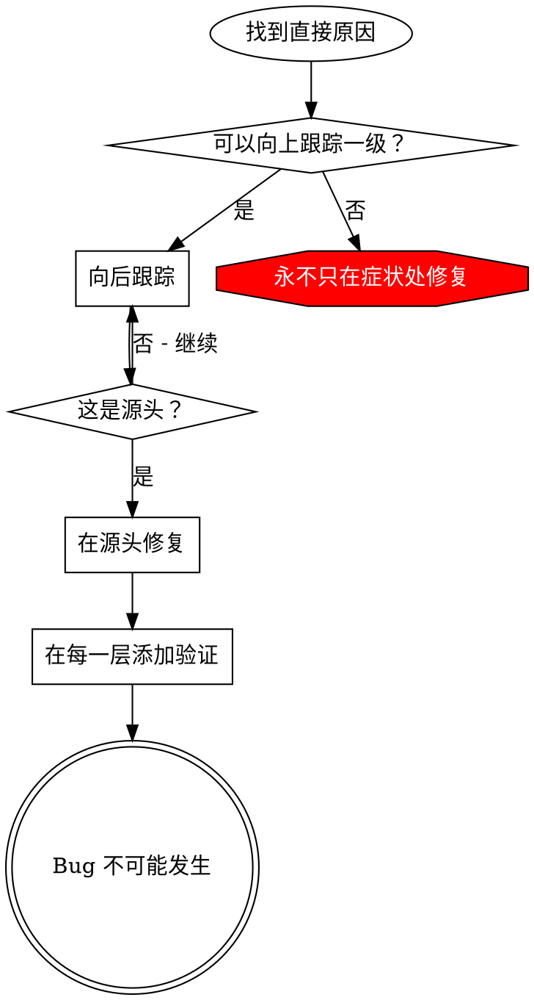

# 根本原因跟踪

## 概述

Bug 经常在调用堆栈深处显现（在错误目录中的 git init、在错误位置创建的文件、用错误路径打开的数据库）。你的本能是修复错误出现的地方，但那是在治疗症状。

**核心原则：** 向后跟踪调用链直到找到原始触发器，然后在源头修复。

## 何时使用



**使用当：**
- 错误发生在执行深处（不在入口点）
- 堆栈跟踪显示长调用链
- 不清楚无效数据从哪里来
- 需要找到哪个测试/代码触发问题

## 跟踪过程

### 1. 观察症状
```
错误：git init 在 /Users/jesse/project/packages/core 中失败
```

### 2. 找到直接原因
**什么代码直接导致这个？**
```typescript
await execFileAsync('git', ['init'], { cwd: projectDir });
```

### 3. 问：什么调用了这个？
```typescript
WorktreeManager.createSessionWorktree(projectDir, sessionId)
  → 被 Session.initializeWorkspace() 调用
  → 被 Session.create() 调用
  → 被 Project.create() 的测试调用
```

### 4. 继续向上跟踪
**传递了什么值？**
- `projectDir = ''`（空字符串！）
- 空字符串作为 `cwd` 解析为 `process.cwd()`
- 那就是源代码目录！

### 5. 找到原始触发器
**空字符串从哪里来？**
```typescript
const context = setupCoreTest(); // 返回 { tempDir: '' }
Project.create('name', context.tempDir); // 在 beforeEach 之前访问！
```

## 添加堆栈跟踪

当你无法手动跟踪时，添加工具：

```typescript
// 在有问题的操作之前
async function gitInit(directory: string) {
  const stack = new Error().stack;
  console.error('DEBUG git init:', {
    directory,
    cwd: process.cwd(),
    nodeEnv: process.env.NODE_ENV,
    stack,
  });

  await execFileAsync('git', ['init'], { cwd: directory });
}
```

**关键：** 在测试中使用 `console.error()`（不是 logger - 可能不显示）

**运行并捕获：**
```bash
npm test 2>&1 | grep 'DEBUG git init'
```

**分析堆栈跟踪：**
- 寻找测试文件名
- 找到触发调用的行号
- 识别模式（同一个测试？同一个参数？）

## 找到哪个测试导致污染

如果某些东西在测试期间出现但你不知道哪个测试：

使用本目录中的二分脚本 `find-polluter.sh`：

```bash
./find-polluter.sh '.git' 'src/**/*.test.ts'
```

逐个运行测试，在第一个污染者处停止。参见脚本了解用法。

## 真实示例：空 projectDir

**症状：** `.git` 在 `packages/core/` 中创建（源代码）

**跟踪链：**
1. `git init` 在 `process.cwd()` 中运行 ← 空 cwd 参数
2. WorktreeManager 用空 projectDir 调用
3. Session.create() 传递了空字符串
4. 测试在 beforeEach 之前访问了 `context.tempDir`
5. setupCoreTest() 初始返回 `{ tempDir: '' }`

**根本原因：** 顶级变量初始化访问空值

**修复：** 使 tempDir 成为一个 getter，如果 beforeEach 之前访问则抛出

**也添加了深度防御：**
- 第一层：Project.create() 验证目录
- 第二层：WorkspaceManager 验证非空
- 第三层：NODE_ENV 防护拒绝临时目录外的 git init
- 第四层：git init 前的堆栈跟踪日志

## 关键原则



**永不只修复错误出现的地方。** 跟踪回去找到原始触发器。

## 堆栈跟踪提示

**在测试中：** 使用 `console.error()` 而不是 logger - logger 可能被抑制
**操作前：** 在危险操作之前记录，而不是在失败后
**包含上下文：** 目录、cwd、环境变量、时间戳
**捕获堆栈：** `new Error().stack` 显示完整调用链

## 现实世界影响

来自调试会话（2025-10-03）：
- 通过 5 级跟踪找到根本原因
- 在源头修复（getter 验证）
- 添加了 4 层防御
- 1847 个测试通过，零污染