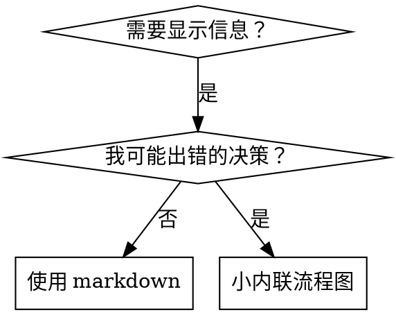

# 编写技能

## 概述

**编写技能就是应用于流程文档的测试驱动开发。**

**个人技能存在于项目目录 `.iflow/skills/` 下**

你编写测试用例（带子代理的压力场景），看着它们失败（基线行为），编写技能（文档），看着测试通过（agent 合规），然后重构（堵住漏洞）。

**核心原则：** 如果你没有在没有技能的情况下看到 agent 失败，你不知道技能是否教对了东西。

**必需背景：** 你必须在使用此技能前理解 test-driven-development。该技能定义了基本的红-绿-重构循环。此技能将 TDD 适应于文档。

## 什么是技能？

**技能**是已验证技术、模式或工具的参考指南。技能帮助未来的 AI 助手实例找到并应用有效方法。

**技能是：** 可重用技术、模式、工具、参考指南

**技能不是：** 关于你如何解决一次问题的叙述

## 技能的 TDD 映射

| TDD 概念 | 技能创建 |
|-------------|----------------|
| **测试用例** | 带子代理的压力场景 |
| **生产代码** | 技能文档（SKILL.md） |
| **测试失败（红）** | Agent 没有技能时违反规则（基线） |
| **测试通过（绿）** | 有技能时 agent 合规 |
| **重构** | 保持合规时堵住漏洞 |
| **先写测试** | 写技能前运行基线场景 |
| **看着它失败** | 记录 agent 使用的确切合理化 |
| **最小代码** | 写解决那些特定违规的技能 |
| **看着它通过** | 验证 agent 现在合规 |
| **重构循环** | 找到新合理化 → 堵住 → 重新验证 |

整个技能创建过程遵循红-绿-重构。

## 何时创建技能

**创建当：**
- 技术对你来说不是直觉明显的
- 你会跨项目再次引用这个
- 模式广泛适用（不是项目特定的）
- 其他人会受益

**不要为以下创建：**
- 一次性解决方案
- 在其他地方文档良好的标准实践
| 项目特定约定（放在 AGENTS.md 或 CLAUDE.md）
| 机械约束（如果可以用正则/验证强制，自动化它——为判断调用保存文档）

## 技能类型

### 技术
有步骤可遵循的具体方法（condition-based-waiting、root-cause-tracing）

### 模式
思考问题的方式（flatten-with-flags、test-invariants）

### 参考
API 文档、语法指南、工具文档（office docs）

## 目录结构


```
skills/
  skill-name/
    SKILL.md              # 主参考（必需）
    supporting-file.*     # 只在需要时
```

**扁平命名空间** - 所有技能在一个可搜索命名空间中

**单独文件用于：**
1. **重参考**（100+ 行）- API 文档、全面语法
2. **可重用工具** - 脚本、工具、模板

**保持内联：**
- 原则和概念
- 代码模式（< 50 行）
- 其他所有内容

## SKILL.md 结构

**前言（YAML）：**
- 只支持两个字段：`name` 和 `description`
- 总共最多 1024 字符
- `name`：只使用字母、数字和连字符（无括号、特殊字符）
- `description`：第三人称，只描述何时使用（不是它做什么）
  - 以"使用当..."开头以关注触发条件
  - 包含特定症状、情况和上下文
  - **永不总结技能的流程或工作流**（见 CSO 部分了解原因）
  - 尽可能保持在 500 字符以下

```markdown
---
name: Skill-Name-With-Hyphens
description: 使用当 [特定触发条件和症状]
---

# 技能名称

## 概述
这是什么？用 1-2 句话表达核心原则。

## 何时使用
[如果决策不明显，小的内联流程图]

带有症状和用例的项目符号列表
何时不使用

## 核心模式（用于技术/模式）
之前/之后代码比较

## 快速参考
用于扫描常见操作的表格或项目符号

## 实现
简单模式的内联代码
重参考或可重用工具的文件链接

## 常见错误
什么出错 + 修复

## 现实世界影响（可选）
具体结果
```


## 技能搜索优化（CSO）

**对发现至关重要：** AI 助手需要能够找到合适的技能

### 1. 丰富的描述字段

**目的：** AI 阅读描述来决定为给定任务加载哪些技能。让它回答："我现在应该读这个技能吗？"

**格式：** 以"使用当..."开头以关注触发条件

**关键：描述 = 何时使用，不是技能做什么**

描述应该只描述触发条件。不要在描述中总结技能的流程或工作流。

**为什么这很重要：** 测试揭示，当描述总结技能工作流时，AI 可能遵循描述而不是阅读完整技能内容。描述说"任务间代码审查"导致 AI 做一次审查，即使技能的流程图清楚显示两次审查（先规范合规然后代码质量）。

当描述改为只是"使用当在当前会话中执行具有独立任务的实现计划时"（无工作流总结），AI 正确阅读流程图并遵循两阶段审查流程。

**陷阱：** 总结工作流的描述创造了 AI 会走的捷径。技能正文变成 AI 跳过的文档。

```yaml
# ❌ 坏：总结工作流 - AI 可能遵循这个而不是阅读技能
description: 使用当执行计划 - 每个任务派遣子代理并在任务间进行代码审查

# ❌ 坏：太多流程细节
description: 用于 TDD - 先写测试，看着它失败，写最小代码，重构

# ✅ 好：只是触发条件，无工作流总结
description: 使用当在当前会话中执行具有独立任务的实现计划

# ✅ 好：只有触发条件
description: 实现任何功能或 bugfix 时使用，在编写实现代码之前
```

**内容：**
- 使用触发 AI 会搜索的具体触发器、症状和情况
- 描述*问题*（竞态条件、不一致行为）不是*语言特定症状*（setTimeout、sleep）
- 保持触发器与技术无关，除非技能本身是技术特定的
- 如果技能是技术特定的，在触发器中明确
- 用第三人称写
- **永不总结技能的流程或工作流**

```yaml
# ❌ 坏：太抽象、模糊、不包含何时使用
description: 用于异步测试

# ❌ 坏：第一人称
description: 我可以帮助你处理不稳定的异步测试

# ❌ 坏：提到技术但技能不是特定的
description: 使用当测试使用 setTimeout/sleep 且不稳定

# ✅ 好：以"使用当"开头，描述问题，无工作流
description: 使用当测试有竞态条件、时序依赖或不一致通过/失败

# ✅ 好：技术特定技能带明确触发器
description: 使用当使用 React Router 处理认证重定向
```

### 2. 关键词覆盖

使用 AI 会搜索的词：
- 错误消息："Hook timed out"、"ENOTEMPTY"、"race condition"
- 症状："flaky"、"hanging"、"zombie"、"pollution"
- 同义词："timeout/hang/freeze"、"cleanup/teardown/afterEach"
- 工具：实际命令、库名称、文件类型

### 3. 描述性命名

**使用主动语态，动词优先：**
- ✅ `creating-skills` 不是 `skill-creation`
- ✅ `condition-based-waiting` 不是 `async-test-helpers`

### 4. 令牌效率（关键）

**问题：** getting-started 和经常引用的技能加载到每次对话中。每个令牌都重要。

**目标字数：**
- getting-started 工作流：每个 <150 字
| 经常加载的技能：总共 <200 字
- 其他技能：<500 字（仍然简洁）

**技术：**

**移动细节到工具帮助：**
```bash
# ❌ 坏：在 SKILL.md 中文档化所有标志
search-conversations 支持 --text、--both、--after DATE、--before DATE、--limit N

# ✅ 好：引用 --help
search-conversations 支持多种模式和过滤器。运行 --help 了解详情。
```

**使用交叉引用：**
```markdown
# ❌ 坏：重复工作流细节
搜索时，用模板派遣子代理...
[20 行重复指令]

# ✅ 好：引用其他技能
始终使用子代理（50-100x 上下文节省）。必需：使用 [other-skill-name] 获取工作流。
```

**压缩示例：**
```markdown
# ❌ 坏：冗长示例（42 字）
your human partner: "我们之前在 React Router 中如何处理认证错误？"
你：我会搜索过去的对话以获取 React Router 认证模式。
[派遣子代理，搜索查询："React Router authentication error handling 401"]

# ✅ 好：最小示例（20 字）
Partner: "我们在 React Router 中如何处理认证错误？"
你：搜索中...
[派遣子代理 → 综合]
```

**消除冗余：**
- 不要重复交叉引用技能中的内容
- 不要解释从命令明显的内容
- 不要包含相同模式的多个示例

**验证：**
```bash
wc -w skills/path/SKILL.md
# getting-started 工作流：每个目标 <150
# 其他经常加载的：总共目标 <200
```

**按你做什么或核心洞察命名：**
- ✅ `condition-based-waiting` > `async-test-helpers`
- ✅ `using-skills` 不是 `skill-usage`
- ✅ `flatten-with-flags` > `data-structure-refactoring`
- ✅ `root-cause-tracing` > `debugging-techniques`

**动名词（-ing）适合流程：**
- `creating-skills`、`testing-skills`、`debugging-with-logs`
- 主动，描述你采取的行动

### 4. 交叉引用其他技能

**编写引用其他技能的文档时：**

只用技能名称，带明确要求标记：
- ✅ 好：`**必需子技能：** 使用 test-driven-development`
- ✅ 好：`**必需背景：** 你必须理解 systematic-debugging`
- ❌ 坏：`见 skills/testing/test-driven-development`（不清楚是否必需）
- ❌ 坏：`@skills/testing/test-driven-development/SKILL.md`（强制加载，消耗上下文）

**为什么没有 @ 链接：** `@` 语法立即强制加载文件，在你需要之前消耗 200k+ 上下文。

## 流程图使用



**只在以下情况使用流程图：**
- 不明显的决策点
- 你可能过早停止的流程循环
- "何时使用 A vs B"决策

**永不使用流程图：**
- 参考材料 → 表格、列表
- 代码示例 → Markdown 块
- 线性指令 → 编号列表
- 没有语义意义的标签（step1、helper2）

参见 @graphviz-conventions.dot 了解 graphviz 风格规则。

**为你的合作伙伴可视化：** 使用本目录中的 `render-graphs.js` 将技能的流程图渲染为 SVG：
```bash
./render-graphs.js ../some-skill           # 每个图表单独
./render-graphs.js ../some-skill --combine # 所有图表在一个 SVG 中
```

## 代码示例

**一个优秀示例胜过许多平庸的**

选择最相关的语言：
- 测试技术 → TypeScript/JavaScript
- 系统调试 → Shell/Python
- 数据处理 → Python

**好的示例：**
- 完整且可运行
| 良好注释解释为什么
- 来自真实场景
- 清晰显示模式
- 准备适应（不是通用模板）

**不要：**
- 用 5+ 种语言实现
- 创建填空模板
- 编写虚假示例

你擅长移植 - 一个优秀示例就够了。

## 文件组织

### 自包含技能
```
defense-in-depth/
  SKILL.md    # 所有内容内联
```
当：所有内容适合，无重参考需要

### 带可重用工具的技能
```
condition-based-waiting/
  SKILL.md    # 概述 + 模式
  example.ts  # 可适应的工作助手
```
当：工具是可重用代码，不只是叙述

### 带重参考的技能
```
pptx/
  SKILL.md       # 概述 + 工作流
  pptxgenjs.md   # 600 行 API 参考
  ooxml.md       # 500 行 XML 结构
  scripts/       # 可执行工具
```
当：参考材料太大无法内联

## 铁律（同 TDD）

```
没有先有失败测试就不能有技能
```

这适用于新技能和现有技能的编辑。

写技能前测试？删除它。重新开始。
编辑技能不测试？同样的违规。

**没有例外：**
- 不为"简单添加"
- 不为"只是添加部分"
- 不为"文档更新"
- 不要保留未测试更改作为"参考"
- 不要在运行测试时"适应"
- 删除意味着删除

**必需背景：** test-driven-development 技能解释为什么这很重要。相同原则适用于文档。

## 测试所有技能类型

不同技能类型需要不同测试方法：

### 纪律强制技能（规则/要求）

**示例：** TDD、verification-before-completion、designing-before-coding

**测试用：**
- 学术问题：他们理解规则吗？
- 压力场景：他们在压力下合规吗？
- 多重压力组合：时间 + 沉没成本 + 疲劳
- 识别合理化并添加明确反驳

**成功标准：** Agent 在最大压力下遵循规则

### 技术技能（如何指南）

**示例：** condition-based-waiting、root-cause-tracing、defensive-programming

**测试用：**
- 应用场景：他们能正确应用技术吗？
- 变化场景：他们处理边界情况吗？
- 缺失信息测试：指令有空白吗？

**成功标准：** Agent 成功应用技术到新场景

### 模式技能（心智模型）

**示例：** reducing-complexity、information-hiding 概念

**测试用：**
- 识别场景：他们识别何时模式适用吗？
- 应用场景：他们能使用心智模型吗？
- 反例：他们知道何时不应用吗？

**成功标准：** Agent 正确识别何时/如何应用模式

### 参考技能（文档/API）

**示例：** API 文档、命令参考、库指南

**测试用：**
- 检索场景：他们能找到正确信息吗？
- 应用场景：他们能正确使用找到的东西吗？
- 空白测试：常见用例被覆盖吗？

**成功标准：** Agent 找到并正确应用参考信息

## 跳过测试的常见合理化

| 借口 | 现实 |
|--------|---------|
| "技能明显清楚" | 对你清楚 ≠ 对其他 agent 清楚。测试它。 |
| "这只是参考" | 参考可能有空白、不清楚部分。测试检索。 |
| "测试是大材小用" | 未测试技能有问题。总是。15 分钟测试节省数小时。 |
| "如果有问题我会测试" | 问题 = agent 无法使用技能。部署前测试。 |
| "测试太繁琐" | 测试比在生产中调试坏技能少繁琐。 |
| "我有信心它是好的" | 过度自信保证问题。无论如何测试。 |
| "学术审查足够" | 阅读 ≠ 使用。测试应用场景。 |
| "没时间测试" | 部署未测试技能稍后浪费时间修复它。 |

**所有这些都意味着：部署前测试。没有例外。**

## 针对合理化的加固技能

强制纪律的技能（如 TDD）需要抵抗合理化。Agent 聪明，在压力下会找到漏洞。

**心理学注：** 理解为什么说服技术有效帮助你系统地应用它们。见 persuasion-principles.md 了解研究基础（Cialdini, 2021; Meincke et al., 2025）关于权威、承诺、稀缺、社会认同和统一原则。

### 明确堵住每个漏洞

不只陈述规则 - 禁止特定的变通方法：

<Bad>
```markdown
测试前写代码？删除它。
```
</Bad>

<Good>
```markdown
测试前写代码？删除它。重新开始。

**没有例外：**
- 不要保留它作为"参考"
- 不要在写测试时"适应"它
- 不要看它
- 删除意味着删除
```
</Good>

### 解决"精神 vs 字面"论点

早期添加基础原则：

```markdown
**违反规则的字面意思就是违反规则的精神。**
```

这切断整类"我在遵循精神"合理化。

### 构建合理化表

从基线测试捕获合理化（见下面测试部分）。Agent 的每个借口放入表格：

```markdown
| 借口 | 现实 |
|--------|---------|
| "太简单不需要测试" | 简单代码也会坏。测试花 30 秒。 |
| "我会在之后测试" | 立即通过的测试什么也证明不了。 |
| "之后的测试达到相同目标" | 之后的测试 = "这个做什么？" 之前的测试 = "这个应该做什么？" |
```

### 创建危险信号列表

使 agent 在合理化时容易自检：

```markdown
## 危险信号 - 停止并重新开始

- 测试前写代码
- "我已经手动测试了"
- "之后的测试达到相同目的"
- "这是精神不是仪式"
- "这是不同的因为..."

**所有这些都意味着：删除代码。用 TDD 重新开始。**
```

### 为违规症状更新 CSO

添加到描述：你即将违规时的症状：

```yaml
description: 实现任何功能或 bugfix 时使用，在编写实现代码之前
```

## 技能的红-绿-重构

遵循 TDD 循环：

### 红：写失败测试（基线）

在没有技能的情况下用子代理运行压力场景。记录确切行为：
- 他们做了什么选择？
- 他们使用了什么合理化（逐字）？
- 哪些压力触发了违规？

这是"看着测试失败" - 你必须在写技能前看到 agent 自然做什么。

### 绿：写最小技能

写解决那些特定合理化的技能。不要为假设情况添加额外内容。

带技能运行相同场景。Agent 现在应该合规。

### 重构：堵住漏洞

Agent 找到新合理化？添加明确反驳。重新测试直到加固。

**测试方法论：** 见 @testing-skills-with-subagents.md 了解完整测试方法论：
- 如何编写压力场景
- 压力类型（时间、沉没成本、权威、疲劳）
- 系统性堵洞
- 元测试技术

## 反模式

### ❌ 叙事示例
"在会话 2025-10-03，我们发现空 projectDir 导致..."
**为什么坏：** 太具体，不可重用

### ❌ 多语言稀释
example-js.js、example-py.py、example-go.go
**为什么坏：** 平庸质量、维护负担

### ❌ 流程图中的代码
```dot
step1 [label="import fs"];
step2 [label="read file"];
```
**为什么坏：** 无法复制粘贴、难阅读

### ❌ 通用标签
helper1、helper2、step3、pattern4
**为什么坏：** 标签应该有语义意义

## 停止：在移至下一个技能之前

**编写任何技能后，你必须停止并完成部署流程。**

**不要：**
- 批量创建多个技能而不测试每个
- 当前技能验证前移至下一个
- 因为"批处理更高效"跳过测试

**下面的部署检查清单对每个技能是强制性的。**

部署未测试技能 = 部署未测试代码。这是违反质量标准。

## 技能创建检查清单（TDD 适应）

**重要：使用 TodoWrite 为下面每个检查清单项目创建任务。**

**红阶段 - 写失败测试：**
- [ ] 创建压力场景（纪律技能 3+ 组合压力）
- [ ] 没有技能运行场景 - 逐字记录基线行为
- [ ] 识别合理化/失败模式

**绿阶段 - 写最小技能：**
- [ ] 名称只使用字母、数字、连字符（无括号/特殊字符）
- [ ] YAML 前言只有 name 和 description（最多 1024 字符）
- [ ] 描述以"使用当..."开头并包含特定触发器/症状
- [ ] 描述用第三人称写
- [ ] 全程有关键词供搜索（错误、症状、工具）
- [ ] 清晰概述带核心原则
- [ ] 解决红阶段识别的特定基线失败
- [ ] 代码内联或链接到单独文件
- [ ] 一个优秀示例（不多语言）
- [ ] 带技能运行场景 - 验证 agent 现在合规

**重构阶段 - 堵住漏洞：**
- [ ] 识别测试中的新合理化
- [ ] 添加明确反驳（如果是纪律技能）
- [ ] 从所有测试迭代构建合理化表
- [ ] 创建危险信号列表
- [ ] 重新测试直到加固

**质量检查：**
- [ ] 只在决策不明显时用小流程图
- [ ] 快速参考表
- [ ] 常见错误部分
- [ ] 无叙事故事
- [ ] 只为工具或重参考有支持文件

**部署：**
- [ ] 提交技能到 git 并推送到你的 fork（如果配置）
- [ ] 考虑通过 PR 回馈（如果广泛有用）

## 发现工作流

AI 助手如何找到你的技能：

1. **遇到问题**（"测试不稳定"）
2. **搜索技能**（描述匹配）
3. **扫描概述**（这是相关的吗？）
4. **阅读模式**（快速参考表）
5. **加载示例**（只在实现时）

**为此流程优化** - 尽早并经常放置可搜索术语。

## 底线

**创建技能就是应用于流程文档的 TDD。**

相同铁律：没有先有失败测试就不能有技能。
相同循环：红（基线）→ 绿（写技能）→ 重构（堵洞）。
相同好处：更好质量、更少意外、加固结果。

如果你为代码遵循 TDD，为技能遵循它。这是应用于文档的相同纪律。